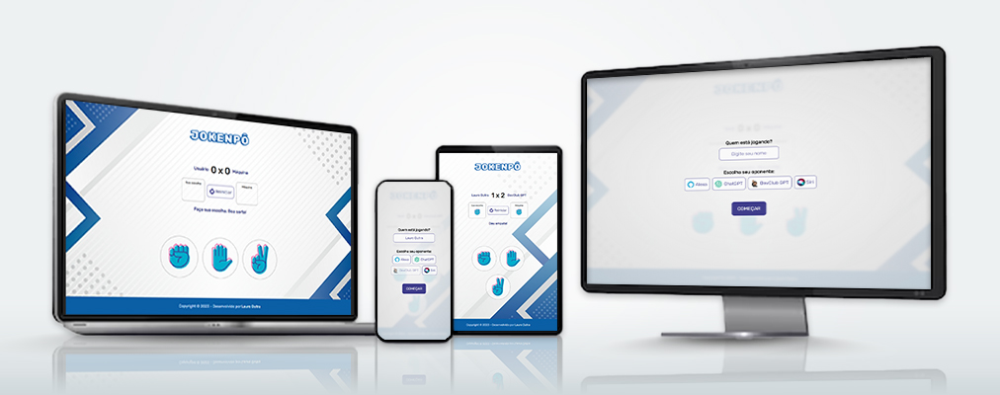

<h1>JOKENPÔ</h1>

## 📝 Sobre

O projeto <b>jokenpô</b> permite você jogar pedra, papel ou tesoura - também chamado de jokenpô - contra uma máquina virtual. O site foi planejado para desktops e dispositivos móveis de diversos tamanhos com um design responsivo que se adapta à tela do  usuário.

## ⚙ Funcionalidades

Para entrar no jogo, basta digitar seu nome (opcional) no campo indicado e escolher um dos oponentes apresentados. No entanto, caso você não queira digitar seu nome nem escolher um oponente, o jogo inicia com os valores padrão: <b>usuário</b> e <b>máquina</b>. Clique em COMEÇAR para entrar na partida. Escolha sua jogada dentre as três opções (pedra, papel ou tesoura) e aguarde a jogada do oponente para o resultado ser exibido. O placar é atualizado de acordo com o ganhador de cada rodada. As regras para determinar o ganhador são as mesmas do jokenpô tradicional; <b>pedra</b> ganha da <b>tesoura</b>, <b>tesoura</b> ganha do <b>papel</b> e <b>papel</b> ganha da <b>pedra</b>. Para zerar o placar, clique em REINICIAR e tudo será zerado. Boa sorte!

## 🤝🏻 Agradecimentos

Deixo meu agradecimento ao <a href="https://www.github.com/rodolfomori">Rodolfo Mori</a>, mentor na escola de formação DevClub, por me ensinar o conhecimento necessário para o desenvolver e aperfeiçoar o projeto com novas funcionalidades e criação de um novo design. 

## 🖥 Tecnologias

Este projeto foi desenvolvido com HTML, CSS e JavaScript.
